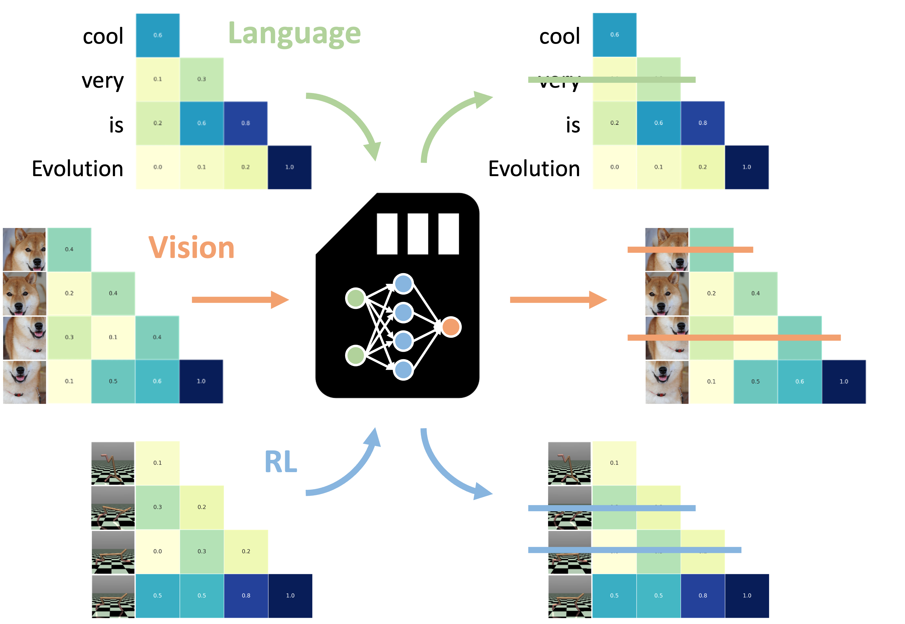

<h1 align="center">
  <a href="https://github.com/SakanaAI/universal-transformer-memory/">
</a><br>
<b>An Evolved Universal Transformer Memory</b><br>
</h1>

<p align="center">
  📚 <a href="https://arxiv.org/abs/2410.X">[Paper]</a> |
  🤗 <a href="https://huggingface.co/SakanaAI">[Hugging Face]</a>
</p>

## Installation

We provide means to install this repository with [conda](https://docs.conda.io/projects/conda/en/latest/index.html):

For the full set of dependecies with fixed versions (provided to ensure some level of long-term reproducibility):

```bash
conda env create --file=env.yaml
```

For a more minimal and less constrained set of dependencies (for future development/extensions):

```bash
conda env create --file=env_minimal.yaml
```

## Usage

### Training

Training following the incremental setup described in our work can be replicated via the following [hydra](https://hydra.cc/) commanda:

stage 1 training:
```bash
torchrun --standalone --nproc_per_node=$NUM_OF_GPUs main.py run@_global_=namm_bam_i1.yaml
```

stage 2 training:
```bash
torchrun --standalone --nproc_per_node=$NUM_OF_GPUs main.py run@_global_=namm_bam_i2.yaml init_from='path/to/stage1/results/ckpt.pt'
```

stage 3 training:
```bash
torchrun --standalone --nproc_per_node=$NUM_OF_GPUs main.py run@_global_=namm_bam_i3.yaml init_from='path/to/stage2/results/ckpt.pt'
```

### Evaluation

Evaluating on the full set of LongBench tasks can be then replicated for both NAMMs with:

```bash
torchrun --standalone --nproc_per_node=$NUM_OF_GPUs main.py run@_global_=namm_bam_eval.yaml init_from='path/to/results/ckpt.pt'
```

Evaluating on the full set of ChouBun task can be replicated with:

```bash
torchrun --standalone --nproc_per_node=$NUM_OF_GPUs main.py run@_global_=namm_bam_eval_choubun.yaml init_from='path/to/results/ckpt.pt'
```

### Additional notes

Using wandb to log the results (through the hydra setting wandb_log=true) requires authenticating to the wandb server via the following command:

```bash
wandb login
```

and using your account's api key (which you should be able to find [here](https://wandb.ai/authorize))

### Gated models (e.g., Llama)

Using gated models requires authenticating to the hugglingface hub by running:

```bash
huggingface-cli login
```

and using your account's access tokens (which you should be able to find [here](https://huggingface.co/settings/tokens))


## Bibtex

To cite our work, you can use the following:

```
@article{sakana2024memory,
  title={An Evolved Universal Transformer Memory},
}
```

